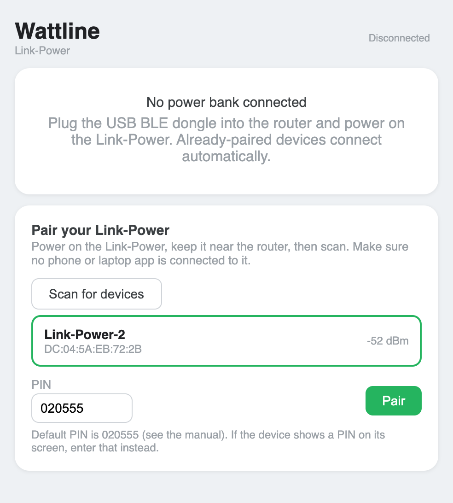
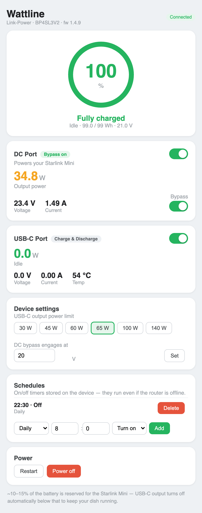

# openwrt-wattline

`wattlined` connects an OpenWrt router to a PeakDo Link-Power portable power
station over Bluetooth LE. It exposes local HTTP and HTTPS APIs, keeps telemetry,
runs rules and webhooks, publishes LAN discovery, and ships both LuCI and native
GL.iNet administration panels. It sends no telemetry off-box and has no cloud
dependency.

The project targets the GL.iNet Spitz AX (GL-X3000) and other
`aarch64_cortex-a53` OpenWrt routers. Most routers require a USB Bluetooth
adapter. CSR8510 adapters work with the stock driver; RTL8761B adapters need the
optional `wattline-rtl8761b` package described in
[`dongle-rtl8761b/`](dongle-rtl8761b/).

The authoritative client contract is [`docs/api.md`](docs/api.md). The separate
[`docs/API.md`](docs/API.md) is the read-only Link-Power BLE protocol reference;
it is not a REST API.

Both UIs cover the full lifecycle:

- **Pairing** — scan, select the Link-Power, enter its PIN, and pair from the
  browser (authenticated BLE bonding; no SSH needed).
- **Monitoring** — battery, DC-port and USB-C telemetry with live updates.
- **Control** — DC / USB-C output and DC bypass toggles; USB-C output power
  limit (30–140 W); DC bypass engage-voltage threshold; on-device on/off
  schedules; and Restart / Power-off.
- **Automation** — the rules engine, webhooks, and a guided Power-loss shutdown
  preset.

See the [changelog](CHANGELOG.md) for version history.

## Screenshots

The native GL.iNet admin-panel app (**Applications → Wattline**). The LuCI app
mirrors the same layout.

| Pairing | Monitoring & control |
|---|---|
|  |  |

## Build the packages

The host needs Go, gzip, and GNU tar (`gtar` on macOS):

```sh
make -C package clean all
package/check-ipk-metadata.sh package/out/*.ipk
```

The default version is `0.1.2`. Override it consistently with, for example,
`make -C package VERSION=1.0.0 all`. A build produces:

- `wattlined_VERSION_aarch64_cortex-a53.ipk`: daemon, procd service,
  first-boot initialization, firewall reconciliation, and interface hotplug;
- `wattline-bt_VERSION_all.ipk`: BlueZ and kernel Bluetooth dependencies;
- `wattline-rtl8761b_VERSION_aarch64_cortex-a53.ipk`: optional, pinned
  GL-X3000 Linux 5.4.211 driver and firmware for USB IDs `2357:0604` and
  `0bda:8771`;
- `luci-app-wattline_VERSION_all.ipk`: LuCI panel; and
- `gl-app-wattline_VERSION_all.ipk`: native GL.iNet panel.

Prebuilt `.ipk`s and an opkg feed index are attached to each
[GitHub release](https://github.com/keithah/openwrt-wattline/releases).
`ARCH` in `package/Makefile` targets `aarch64_cortex-a53`; adjust it when
packaging for a different OpenWrt target.

### Releasing

GitHub Actions tests and builds every push and pull request. Pushing a `v*` tag
builds the five packages and feed index, publishes a GitHub release, and updates
the `gh-pages` feed. The tag supplies the package version after stripping `v`:

```sh
git tag v0.1.2 && git push origin v0.1.2
```

### `.ipk` format (verified on-target)

These OpenWrt packages are gzip-compressed outer tar archives containing
`debian-binary`, `control.tar.gz`, and `data.tar.gz`. Both the outer and inner
archives use ustar. They are deliberately not ar/deb archives: the GL-X3000
opkg version rejects pax headers and has crashed on ar-form packages.

## Install or upgrade a router

Use the Starwatch-style installer from the hosted feed:

```sh
wget -qO- https://keithah.github.io/openwrt-wattline/install.sh | sh
```

The installer verifies `aarch64_cortex-a53`, preserves existing opkg feeds,
selects the GL.iNet or LuCI panel, and installs the daemon and Bluetooth
dependencies. It scans `/sys/bus/usb/devices` for RTL8761B IDs `2357:0604` or
`0bda:8771`; only when one is present does it install
`wattline-rtl8761b`. No RTL package is staged on routers without that adapter.

RTL installation is file-only and inert. Runtime activation remains explicit:

```sh
/usr/lib/wattline/rtl8761b/driverctl activate --require-device
# after health and reboot verification only:
/usr/lib/wattline/rtl8761b/driverctl enable-boot
```

The driver controller validates the exact kernel, USB identity, module hashes,
and firmware, creates a rollback marker before mutation, and restores stock
modules on failure. Use `driverctl restore` for recovery; it preserves the
stock backup. `disable-boot` removes only the opt-in boot marker.

The Wattline init script uses the normal OpenWrt service interface and a direct
PID-file fallback for GL-X3000 images whose `procd/ubus` supervisor is
unresponsive. This keeps start/stop/health behavior working without changing
router firmware.

For development or a pinned release, download the five IPKs from GitHub and
install only the base packages first. Use the same USB-ID check before installing
the optional RTL package.

### Updating without a manual reinstall (opkg feed)

Copying ipks by hand is only for first-time/dev installs. For updates, host
the packages as an **opkg feed** (an HTTP dir with a `Packages.gz` index) —
the same mechanism GL's own apps and the unofficial Speedify use — then the
router upgrades with `opkg upgrade` (or the GL **Plug-ins** page).

```sh
# Build all ipks + the feed index. BUMP THE VERSION each release so opkg
# detects an upgrade (the Version: field, filename, and index must all match —
# the Makefile injects VERSION into all three).
make -C package VERSION=0.1.2 feed
# → package/out/{*.ipk, Packages, Packages.gz}
```

## Configuration

The main UCI section is `/etc/config/wattline`:

```text
config wattline 'main'
	option device_mac ''
	option pin '020555'
	option token ''
	option http_enabled '1'
	option http_addr4 '0.0.0.0'
	option http_addr6 '::'
	option port '8377'
	option https_enabled '1'
	option https_addr4 '0.0.0.0'
	option https_addr6 '::'
	option https_port '8378'
	option tls_cert '/etc/wattline/tls/server.crt'
	option tls_key '/etc/wattline/tls/server.key'
	option token_store '/etc/wattline/tokens.json'
	option pairing_ttl '5m'
	option pairing_always_on '0'
	option advanced '0'
	option mdns_enabled '1'
	list mdns_interface 'br-lan'
	option wan_access '0'
```

`pin` is the six-digit Link-Power BLE PIN (returned as `ble_pin` by the settings
API). `token` is the
non-revocable bootstrap administrator secret. The first-boot initializer fills
blank credentials and missing modern keys without replacing existing values.
Legacy `port` and `lan_api` continue to load; new installations should use the
listener keys above.

```text
config rule 'no_input_shutdown'
	option enabled '0'
	option condition 'input_power'
	option state 'absent'
	option hold '10m'
	list action 'shutdown'
	option confirm_shutdown '1'

# Thermal cutoff: disable USB-C output if the port runs hot for 1 min.
config rule 'usbc_thermal'
	option enabled '0'
	option condition 'temperature'   # USB-C port temperature (°C)
	option op 'above'
	option temp_c '60'
	option hold '1m'
	list action 'usbc_off'
```

Rule conditions: `input_power`, `battery_level`, `port_power`, `temperature`
(USB-C port °C), and `schedule` (cron). `battery_level` and `temperature`
re-arm with a hysteresis margin (`option hysteresis_margin`, default 5) to
avoid flapping near the threshold.

Rules can also be managed live through the API (see below); edits made via
the API are persisted back to this UCI file, and the running daemon is
reloaded with `SIGHUP` (procd's `service_triggers`/`reload_service` wire this
up automatically on `uci commit wattline` + `ubus call service reload`, or
manually via `/etc/init.d/wattlined reload`).

### Power-loss shutdown preset

The reserved `no_input_shutdown` preset waits until input power has been
continuously absent for 10 minutes by default, then attempts one Link-Power
shutdown. If input power returns before the delay expires, the countdown is
cancelled and the rule re-arms. A BLE disconnect also resets the hold so time
without telemetry never counts toward shutdown.

In the native GL panel, open **Applications → Wattline** and use the
**Power-loss shutdown** card. In LuCI, open **Services → Wattline** and use the
**Power-loss shutdown** card. A compatible existing rule keeps its additional
valid fields and actions; the cards change only its enabled state, delay, and
required shutdown confirmation. A conflicting reserved rule is left untouched
unless the operator explicitly confirms **Reset preset**.

Shutting down Link-Power also removes power from this router. Recovery is
hardware-driven: after input returns, Link-Power wakes, the GL-X3000 boots, and
`wattlined` reconnects. The daemon cannot provide a software wake while the
router is off. The card's “last fired” state records an attempted trigger, not
proof that shutdown succeeded; check daemon logs and events for action errors.

HTTP and HTTPS bind IPv4 and IPv6 independently. Both default to all addresses,
which makes LAN, `tailscale0`, and other WireGuard/VPN interfaces reachable.
That does not open the OpenWrt WAN firewall. `wan_access=0` is the safe default.
Setting it to `1` installs TCP WAN rules for enabled listeners and logs
`insecure — use TLS/VPN`; direct plain-HTTP WAN exposure is unsafe.
On GL firmware, late WWAN or Speedify events can reload fw3 after Tailscale has
installed its dynamic `ts-*` chains. Wattline detects that exact missing-chain
state after daemon and interface firewall reconciliation and asks an enabled
Tailscale daemon to rebuild its netfilter integration. It does not restart the
daemon, alter its other preferences, disturb netifd-managed WireGuard
interfaces, or enable a disabled Tailscale installation.

Apply UCI changes with:

```sh
uci commit wattline
/etc/init.d/wattlined reload
```

Rule-only changes use SIGHUP and retain the BLE link. A changed main section is
restarted so listeners, authentication, discovery, and firewall policy cannot
drift. The settings API reports `restart_required` for changes that need this.

## Connect and enroll clients

Read the bootstrap token on the router and test both transports:

```sh
TOKEN=$(ssh root@192.168.8.1 'uci -q get wattline.main.token')
HOST=$(ssh root@192.168.8.1 'hostname')
ssh root@192.168.8.1 'cat /etc/wattline/tls/server.crt' > wattline-server.crt
curl -H "Authorization: Bearer $TOKEN" \
  http://192.168.8.1:8377/api/v1/device
curl --cacert wattline-server.crt --resolve "$HOST:8378:192.168.8.1" \
  -H "Authorization: Bearer $TOKEN" "https://$HOST:8378/api/v1/device"
```

The curl example explicitly trusts the copied certificate and uses its hostname.
Apps follow the stricter DER SHA-256 pinning flow in the API contract: verify the
pin before sending a bearer token, hard-fail a mismatch, and never silently
downgrade to HTTP.

For app enrollment, an administrator opens pairing mode and displays its PIN or
QR. Each client exchanges the short-lived PIN for its own token:

```sh
curl -X POST -H "Authorization: Bearer $TOKEN" \
  http://192.168.8.1:8377/api/v1/pairing-mode
curl -H "Authorization: Bearer $TOKEN" \
  http://192.168.8.1:8377/api/v1/pairing-mode/qr.png > wattline-pair.png
curl -H 'Content-Type: application/json' \
  -d '{"pin":"123456","label":"Keith iPhone"}' \
  http://192.168.8.1:8377/api/v1/pair
```

The pair response returns a new `wlt_...` client token only once, the HTTP/HTTPS
base URLs, MagicDNS name when available, and the DER-certificate SHA-256 for
pinning. Managed tokens may read rules and use ordinary device controls; the
bootstrap administrator is required to create/update/delete rules or execute a
manual webhook from the router. List metadata or revoke a managed token with
admin authentication:

```sh
curl -H "Authorization: Bearer $TOKEN" http://192.168.8.1:8377/api/v1/tokens
curl -X DELETE -H "Authorization: Bearer $TOKEN" \
  http://192.168.8.1:8377/api/v1/tokens/TOKEN_ID
```

`pairing_always_on=1` removes the explicit UI-button requirement but leaves an
enrollment PIN continuously available and rotating. Use it only when that local
attack-surface tradeoff is acceptable. It does not expose the BLE PIN.

## Discovery and VPN reachability

After the BLE identity is known, the daemon advertises `_wattline._tcp` on the
configured LAN interfaces. Its TXT record includes API/version, device MAC,
model, CID, features, authentication mode, and TLS fingerprint. It never
advertises on WAN or tunnel interfaces. Browse it from a LAN host with:

```sh
dns-sd -B _wattline._tcp local
avahi-browse -rt _wattline._tcp
```

mDNS is LAN-only. Remote clients save their issued token and use the router's
Tailscale MagicDNS name or another VPN address. The mDNS `id` correlates the LAN
advertisement with the same remote device. Binding all interfaces is sufficient
for Tailscale and ordinary WireGuard interfaces when their own ACL/firewall
policy permits the connection. `tailscale serve` is optional, not required.

## BLE-device pairing and operation

The LuCI and GL panels can scan, pair, trust, and remove a Link-Power. Pairing is
asynchronous: poll `GET /api/v1/pairing/status` until `paired` or `error`, then
use `GET /api/v1/device` as the authoritative connection result. The default BLE
PIN is `020555`; it is distinct from the short-lived API-client pairing PIN.

Both panels also expose identity, controls, pairing PIN/QR, token revocation,
listener/TLS/reachability policy, and advanced settings. Rules, webhooks,
telemetry history, and SSE remain available through the versioned API.

The API exposes OTA mode INFO plus enter and exit operations. It does **not**
download, erase, program, verify, upload, or flash firmware.

## Development and verification

Transport-independent code runs on any Go development host:

```sh
go test -count=1 ./...
go test -race -count=1 ./internal/state/ ./internal/ble/ ./internal/control/ \
  ./internal/auth/ ./internal/api/ ./internal/server/ ./internal/discovery/
go vet ./...
```

Production BLE uses Linux/BlueZ. Non-Linux builds use the explicit unsupported
transport, so a macOS daemon can exercise API/rules behavior but cannot validate
real Link-Power traffic. Follow the
[`GL-X3000 verification checklist`](docs/gl-x3000-verification.md) for the
remaining on-target and real-BLE checks. No item in that checklist is considered
verified merely because unit tests pass.
## Quick install

On a supported GL.iNet/OpenWrt router, run the project-maintained installer:

```sh
wget -qO- https://keithah.github.io/openwrt-wattline/install.sh | sh
```

The installer verifies the architecture, preserves existing opkg feeds, selects the GL or LuCI UI, and installs the optional RTL8761B package only when a supported USB adapter is detected. Driver activation is always a separate explicit transaction.

Wattline is licensed under the GNU Affero General Public License, version 3 (AGPL-3.0-or-later); see [LICENSE](LICENSE).

